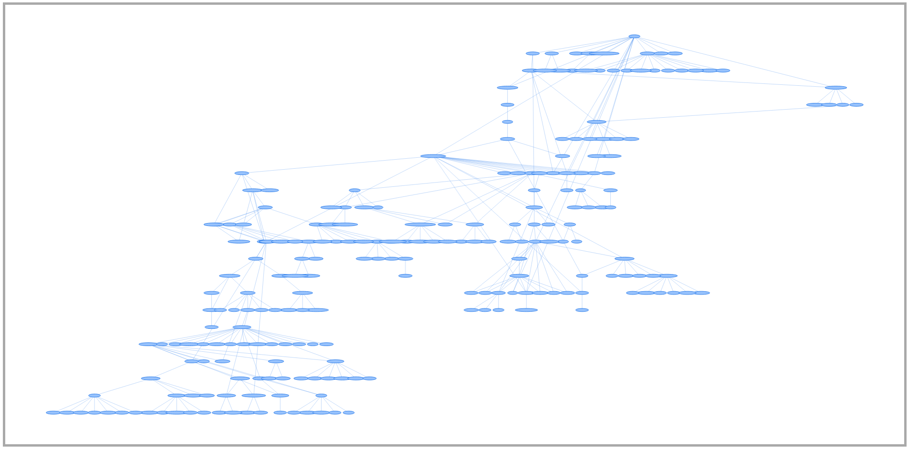

# Web-Scraper
A scrapy spider that crawls wikipedia to generate a tree showing the PhD advisor/student relationships for a bunch of people. For example, [Carl Gauss](https://en.wikipedia.org/wiki/Carl_Friedrich_Gauss) was the doctoral advisor of Bernhard Riemann, so Riemann would be a child node of Gauss in the graph. You can find an **interactive** result [here](https://srivastavaanubhav.github.io/Web-Scraper/).

## Examples
Here's the result when I bound the recursion depth to 6 (and starting at Joseph-Louis Lagrange). You can see it's already a pretty large graph! I'll do higher values later (I don't anticipate allowing the user to generate this live for processing time reasons).

---

Here's the cleanest part of the above graph, zoomed in. Try playing around with the interactive graph, it's pretty cool!

## Current state
The project currently takes in a name of a person and their Wikipedia page and recursively follows links to their teachers (could be doctoral advisors or academic influences) and their students (both of which are usually provided in the summary table on the right of their page, if it exists. I was amazed to see how quickly one could get to Euler and other big names.

The website for this project uses VisJS to visualize the tree-like layout, though there are some bugs that result in overlapping nodes.

## Goals
- On selection of a node, bring up a brief profile
- I want to correlate influence (measured by H-index or some other metric) and colour-code respectively

## Running the project
If you have scrapy and its dependencies installed, running `scrapy crawl teachers` from command line should generate data.json, after which you should run `python parser.py` to convert data.json to myGraph.json, the Gephi-style format VisJS requires.
